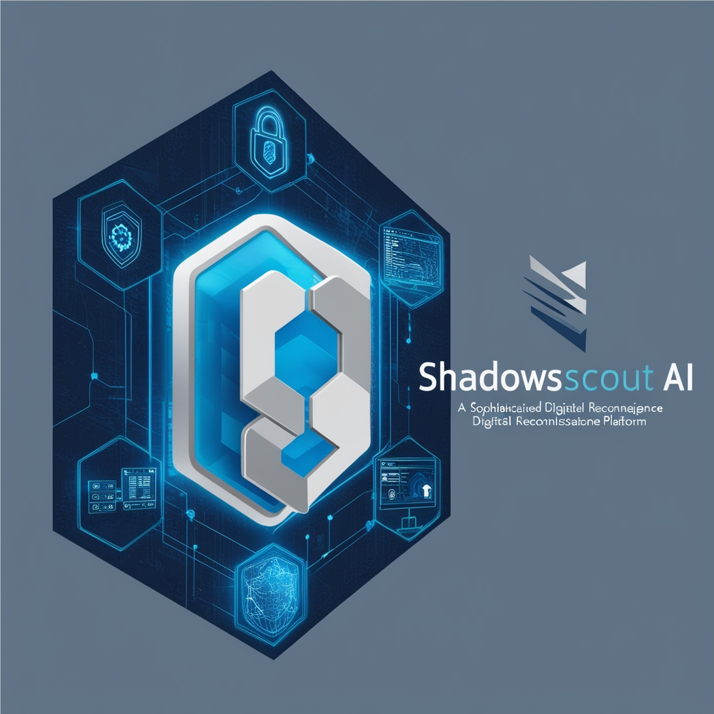

# ShadowScout AI

<div align="center">
  
  <br>
  <strong>Advanced Neural-Powered Security Assessment System</strong>
</div>

## Overview

ShadowScout AI is a cutting-edge security assessment platform that combines GPT-4's neural intelligence with advanced reconnaissance capabilities. It leverages multiple AI-powered assistants to perform comprehensive security analysis while maintaining operational stealth.

## Core Capabilities

### 🧠 Neural Intelligence
- **Adaptive Analysis**: Real-time strategy adjustment based on target responses
- **Pattern Recognition**: Advanced vulnerability detection through AI analysis
- **Intelligent Automation**: Self-evolving scan patterns and techniques
- **Predictive Assessment**: Anticipate security weaknesses and attack vectors

### 🔍 Advanced Reconnaissance
- **Deep Scanning**: Multi-layer technology stack analysis
- **Stealth Operation**: Low-footprint information gathering
- **Network Mapping**: Comprehensive infrastructure assessment
- **Vulnerability Detection**: AI-driven security flaw identification

### ⚡ Offensive Capabilities
- **Automated Exploitation**: Smart vulnerability verification
- **Attack Chaining**: Intelligent multi-vector attack strategies
- **Custom Payload Generation**: Context-aware exploit development
- **Advanced Evasion**: Dynamic bypass techniques

## Key Features

### 🛠️ Modular Architecture
- **Browser Assistant**: Automated web interaction and DOM analysis
- **Security Tools**: Comprehensive scanning and assessment
- **Terminal Assistant**: System-level operations
- **Attack Strategist**: Intelligent attack planning
- **Offensive Assistant**: Advanced exploitation capabilities
- **Results Logger**: Detailed reporting and analysis

### 📊 Analysis & Reporting
- Real-time progress monitoring
- Detailed vulnerability assessment
- Attack path visualization
- Comprehensive scan reports
- JSON-formatted results

## Quick Start

### Prerequisites
- Python 3.8+
- OpenAI API Key
- Valid security testing authorization

### Installation
```bash
# Clone repository
git clone https://github.com/yourusername/ShadowScout-AI.git
cd ShadowScout-AI

# Create virtual environment
python -m venv venv
source venv/bin/activate  # Linux/Mac
# or
.\venv\Scripts\activate   # Windows

# Install dependencies
pip install -r requirements.txt
playwright install
```

### Configuration
Create `.env` file:
```env
OPENAI_API_KEY=your_api_key_here
MODEL_NAME=gpt-4
OUTPUT_DIR=scan_results
```

### Basic Usage
```bash
python main.py --target https://example.com
```

## Project Structure
```
ShadowScout-AI/
├── assistants/
│   ├── browser_assistant.py     # Web automation
│   ├── terminal_assistant.py    # System operations
│   ├── langchain_assistant.py   # AI coordination
│   ├── security_tools.py        # Security scanning
│   ├── attack_strategist.py     # Attack planning
│   ├── offensive_assistant.py   # Exploitation
│   └── offensive_tools.py       # Attack tools
├── utils/
│   └── results_logger.py        # Logging system
├── config/
│   └── config.py               # Configuration
├── docs/
│   └── assets/
│       └── images/             # Project images
├── scan_results/               # Scan outputs
├── requirements.txt
└── main.py
```

## Advanced Usage

### Custom Scan Profiles
```bash
python main.py --target https://example.com --profile stealth
python main.py --target https://example.com --profile aggressive
```

### Output Formats
- JSON reports
- Terminal visualization
- Attack path graphs
- Vulnerability matrices

## Security Notice

⚠️ **Important**: This tool is for authorized security testing only.
- Obtain proper authorization before scanning
- Follow responsible disclosure practices
- Comply with applicable laws and regulations
- Handle findings securely and responsibly

## Contributing

See [CONTRIBUTING.md](CONTRIBUTING.md) for guidelines.

## Security

See [SECURITY.md](SECURITY.md) for vulnerability reporting.

## License

This project is licensed under the MIT License - see [LICENSE](LICENSE) file.

## Acknowledgments

- OpenAI GPT-4
- LangChain Framework
- Playwright
- Rich CLI